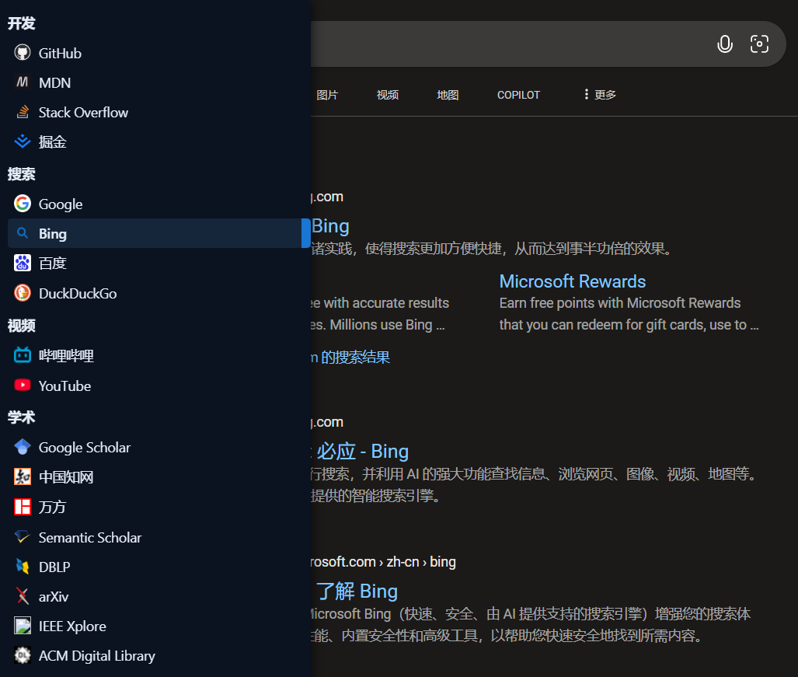

# Sidebar Search Switcher 侧边栏搜索切换

在浏览器中，为搜索网站左侧添加一个侧边搜索引擎切换面板。不使用第三方框架实现。



## 功能特性

- 自动识别当前页面是否属于某个引擎的主机/路径，匹配才显示侧边栏，避免在不相关站点打扰
- 从地址栏参数或页面输入框智能提取关键词，点击即可在其他引擎打开
- 分组展示引擎，显示网站图标（通过 favicon 服务）
- 选项页支持：恢复默认配置、导入、导出、JSON 直接编辑，深色模式指示
- 零构建、即装即用；Manifest V3，内容脚本运行在 document_idle

## 目录结构

```
content/
	sidebar.css     # 侧边栏样式（含深色模式变量、隐藏滚动条等）
	sidebar.js      # 内容脚本：UI 构建、URL 模板推断、关键词提取、点击跳转
options/
	options.html    # 选项页（原生样式 + 深色模式）
	options.js      # 选项页逻辑（导入/导出/保存/恢复默认）
popup/
	popup.html      # 弹窗页面（打开选项页）
	popup.js        # 弹窗脚本
manifest.json     # MV3 清单，声明权限、内容脚本与可访问资源
data.json         # 默认配置（分组与引擎列表）
README.md         # 项目说明
```

## 安装与使用

1) 下载/克隆本项目到本地
2) 打开 Chrome/Edge 扩展管理页
	 - Chrome: 访问 chrome://extensions/
	 - Edge: 访问 edge://extensions/
3) 开启“开发者模式”，点击“加载已解压的扩展程序”，选择本项目根目录
4) 安装后：
	 - 在支持的站点（如 Google/Bing/百度 等）左侧会出现可展开的侧栏
	 - 点击侧栏中的引擎项，将把当前关键词带到目标引擎
5) 打开扩展弹窗，点击“打开选项页面”，可导入/导出/编辑配置

提示：侧栏默认在页面左侧以“细边”形式折叠，鼠标悬停或点击可展开；按 Esc 或移出侧栏可收起。

## 工作原理（简述）

- URL 模板推断：从每个引擎的 `urlTemplate` 推断出协议、主机与路径前缀，并据此判断“当前页面是否属于该引擎”（只要有任意引擎匹配才渲染侧栏）
- 关键词提取顺序：
	1. 地址栏查询参数（按键名优先级）
	2. Hash 中的查询参数
	3. 页面上常见文本/搜索输入框的可见值（并与 URL 进行包含性校验）
- 常见参数键名列表：`q`, `keyword`, `key`, `searchKeyWord`, `kw`, `wd`, `text`, `w`, `s`, `exxshu`
- 点击跳转：将 `{keyword}` 或 `%s` 用编码后的关键词替换到模板中，优先在当前页导航，异常时回退到新标签页

## 配置说明（data.json）

默认配置位于 `data.json`，安装后也会被复制到浏览器 `storage` 中的 `sidebarConfig` 键下。结构示例如下：

```json
{
	"setting": {
		"showIcon": false,
		"openInNewTab": false
	},
	"listData": [
		{
			"name": "搜索",
			"items": [
				{ "name": "Google", "urlTemplate": "https://www.google.com/search?q={keyword}" },
				{ "name": "Bing",   "urlTemplate": "https://www.bing.com/search?q={keyword}" },
				{ "name": "百度",    "urlTemplate": "https://www.baidu.com/s?wd={keyword}" }
			]
		}
	]
}
```

字段含义：
- setting
	- showIcon: 是否在 UI 中使用额外图标（当前版本未使用，保留扩展空间）
	- openInNewTab: 是否新开标签页（当前版本默认同页跳转，失败时回退新开）
- listData: 分组数组
	- name: 分组名
	- items: 引擎数组，`name` 为显示名，`urlTemplate` 为跳转模板（支持 `{keyword}` 或 `%s` 占位符）

说明：内容脚本会将 `g.list`/`it.engine`/`it.url` 等旧字段名归一化到 `name/urlTemplate`，方便兼容既有数据。

## 选项页操作

- 恢复默认配置：从扩展包内 `data.json` 读取并写入到 `storage`
- 导出配置：优先导出 `storage.sidebarConfig`，若无则兼容旧键或回退 `data.json`
- 导入配置：选择本地 JSON，校验成功后写入 `storage.sidebarConfig`
- 直接编辑：在文本框中编辑 JSON，点击“保存配置”生效

## 权限与隐私

- 权限：`storage`, `activeTab`, `scripting`（按 Manifest V3 要求声明；内容脚本固定注入在 `document_idle`）
- 可访问资源：`data.json`（用于恢复默认配置）
- 网络：为显示站点图标，内容脚本会访问 `https://favicon.im/<host>` 获取 favicon；若不希望外网请求，可在样式中隐藏图标或修改代码
- 数据：配置保存在浏览器本地 `storage`，不上传到任何服务器

## 已知限制

- 某些站点可能对高 z-index/固定定位做了强样式覆盖，侧栏样式可能需要微调
- 关键词提取依赖地址栏参数或可见输入框，若站点采用复杂的前端路由/混淆，可能无法准确提取
- `setting.openInNewTab` 当前未严格执行（默认同页导航），后续版本可在选项页提供切换

## 开发

- 直接修改源码，无需打包；保存后在扩展管理页点击“刷新”即可
- 内容脚本入口：`content/sidebar.js`；样式：`content/sidebar.css`
- 选项页：`options/options.html` + `options/options.js`
- 弹窗：`popup/popup.html` + `popup/popup.js`

## 致谢

- favicon 提供：`favicon.im`
- 以及所有为搜索效率折腾不止的你 🙂
